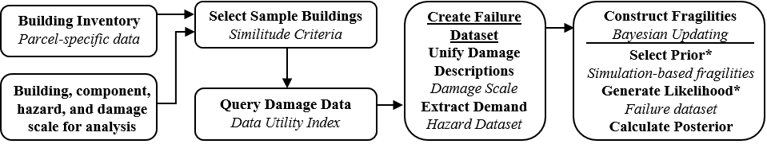

# Bayesian Data Integration Framework for the Development of Component-level Fragilities Derived from Multiple Post-Disaster Datasets
## Project Overview
Note: the research developments herein have been formalized into a manuscript that is currently under review in [Structural Safety](https://www.journals.elsevier.com/structural-safety) and the link for this article will be included once it is available.

### Context
- The design of targeted mitigation strategies and policies to reduce disaster-related losses across entire regions requires the realization of building-specific, component-level regional loss assessments. However, such highly granular loss assessments face a unique challenge in sourcing reliable fragilities for actual constructed buildings, particularly for the case of wind-vulnerable structures. 

### Data Opportunity
- Field observations from reconnaissance missions 
  - [Growing efforts](https://www.steer.network/) to ensure these surveys capture component-level damage in an unbiased fashion
  - Increasing accessibility to this data through [online repositories](https://www.designsafe-ci.org/recon-portal/)
- New forms of post-disaster datasets emerging as a result of remote sensing technologies, street-level panoramic imaging, and the ever-growing open data landscape

### Project Goal

*Formalize a replicable, automated workflow for the development of component-level fragilites that utilizes multiple post-disaster datasets* that:
1. Generalizes the process of sample building selection beyond the requirements of a specific building archetype and hazard
2. Formalizes the integration of damage data without relying on the presence of specific post-disaster datasets
3. Supports fragility model development for a range of data availability use cases

### The How

Schematic overview of Bayesian Data Integration framework:

Fragilities are automatically created for a given building's components according to a specified damage scale (associated with a specific hazard) through a set of subroutines that automate:
- Building sample selection
  - Here we define a set of similitude criteria which evaluate feature and load path similarity between potential samples in an inventory and a given reference building
- Damage data querying and integration
  - We formalized a data utility index that evaluates each available damage observation across the following data quality measures: granularity, precision, accuracy, perishability. This allows the framework to automatically identify the most reliable and granular observation for each sample building
- Fragility model updating
  - This implementation utilizes the [PyMC3](https://docs.pymc.io/en/v3/index.html) library and available simulation-based fragilities

## Overview of Skills Necessary to Implement this Project:
### Data Science
Web-scraping, Application Programming Interface, Data cleaning and manipulation
### Probability/Statistics
Bayesian model updating, Gaussian mixture model, Cumulative distribution functions
