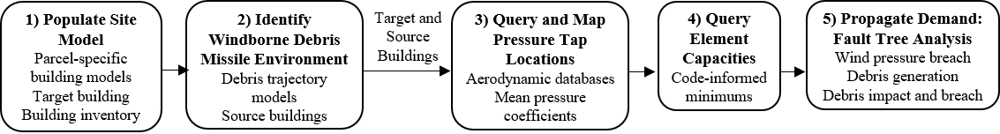

# Data-Driven Framework for Automated Simulation of Wind and Windborne Debris (WBD) Effects for Hurricane Regional Loss Assessment

## Project Overview
### Context
The development of open-source scientific workflows that conduct site-specific, building-specific and component-level loss assessments across entire regions is imperative to minimizing disaster losses in the United States. *However, today's open-source workflows are limited in their ability to simulate site-specific effects of wind and WBD hazards on actual constructed buildings. Such granularity is ultimately necessary to identify hazard- and building-specific, component-level damage across diverse, hurricane-vulnerable building inventories.*

### Data Opportunity
The ever-growing open data landscape is exposing a number of data sources (e.g., building footprints, national survey data, tax assessor data) that contain valuable building and site information pertinent to loss estimation workflows. 

We propose that this data can be used to advance the natural hazards engineering community's ability to simulate site-specific effects of wind and WBD hazards on buildings within a hurricane regional loss assessment.

### Project Goal

Formalize a new framework that utilizes publically available data to enable the modeling and analysis capabilities necessary to:
1. capture site-specific, building-specific exposure to wind and WBD hazards and 
2. propagate these demands through the building envelope’s load path

### The How

Schematic overview of the data-driven framework:

The framework utilizes building tax assessor data, open-source probabilistic debris trajectory models, aerodynamic databases of surface pressures, and code-informed minimum requirements/scientific literature to respectively formalize **data-driven characterizations** of: 
(1) site models, (2) WBD missile environment, (3) wind pressure coefficient distributions, and (4) component capacities. 

These data-driven characterizations then enable the realization of demand propagation, currently achieved through a data-driven fault tree analysis (**Monte Carlo simulation**).

The accompanying publication for this work (see below) demonstrates that the framework’s data-driven characterizations can be utilized to: 
1. specify site models with all relevant buildings to streamline the query and incorporation of element- to site-level information
2. identify probable WBD source buildings for a given target building, wind speed intensity and wind angle-of-attack 
3. generate site- and building-specific distributions of wind pressure coefficients
4. specify building-specific, minimum component capacities, and 
5. conduct a site- and building-specific fault tree analysis to propagate demand through the building envelope’s load path.

### Broader Impacts
- The framework has the potential to reveal hazard-, site- and building-specific impacts and thereby the benefits of mitigation investments made in response
- The framework provides an important first step towards capturing site-specific wind effects on actual constructed buildings, enhancing modeling and analysis capabilities for granular and robust hurricane regional loss estimation

## Publications

The accompanying publication for this research development can be found in [Journal of Wind Engineering and Industrial Aerodynamics](https://doi.org/10.1016/j.jweia.2022.105167).

In the paper, the framework is applied to a case study region in Panama City, FL to evaluate the effects of wind and WBD hazard on a four-story office building. Building and site models for this case study are informed using open data, similar to the process described in (Angeles and Kijewski-Correa 2022). The framework is used to identify source buildings (2 total) for this target structure considering an inventory of 27 total buildings, all located within a 200 m radius. The three buildings are pressurized under their respective Hurricane Michael peak gust wind speeds and a fault tree analysis is conducted to identify regions of wind- and WBD-related damage.

Reference: Angeles, K. and Kijewski-Correa, T. (2022). “Advancing Building Data Models for the Automation of High-fidelity Regional Loss Estimations using Open Data.” Automation in Construction, 140, 104382. https://doi.org/10.1016/j.autcon.2022.104382.

## Overview of Skills Necessary to Develop this Project
### Data Science
**Data Mining** 
- Web-scraping ([scrapy](https://scrapy.org/) Python package) to extract parcel tax assessor data from the Bay County Property Appraiser's website

**Data Wrangling** 
- Data cleaning: establishing data fields, filling in missing values, removing duplicates
- Data modeling: creating workflows to populate data fields in parcel-specific, object-oriented building models and applying element-to-site spatial relationships

**Data Exploration**
- [Pandas](https://pandas.pydata.org/) to obtain an overview of roof cover debris types in Florida's Bay County and conduct mappings of surface pressures across the envelopes of individual buildings
- [Matplotlib](https://matplotlib.org/) to plot probable WBD source regions, surface pressure distribution, code-informed pressure zones, and hazard-specific damage on the building envelope

**Feature Engineering**
- Utilized extracted open data descriptions to generate additional framework-imperative data. This includes:
  - Three-dimensional representations of buildings in inventory
  - Site-specific source buildings for each target according to wind speed intensity and angle-of-attack
  - Building-specific pressure tap locations and mean pressure coefficients
  - Minimum component external pressure and debris impact capacities

### Probability/Statistics
Monte Carlo simulation, Cumulative distribution functions, Random variables (uncertainty modeling), Descriptive statistics (e.g., mean, standard deviation)

### Civil/Structural Engineering
Knowledge of building load paths for wind-vulnerable buildings (various typologies), fault tree analyses, windborne debris trajectory models, database-assisted design (wind pressures). Understanding of the current state-of-practice in hurricane regional loss assessment and new efforts in open-source loss modeling. 
